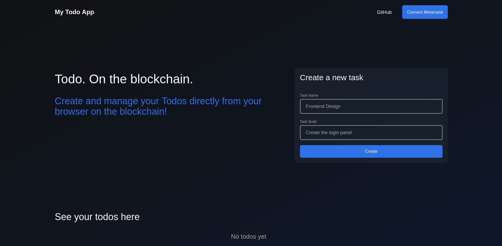
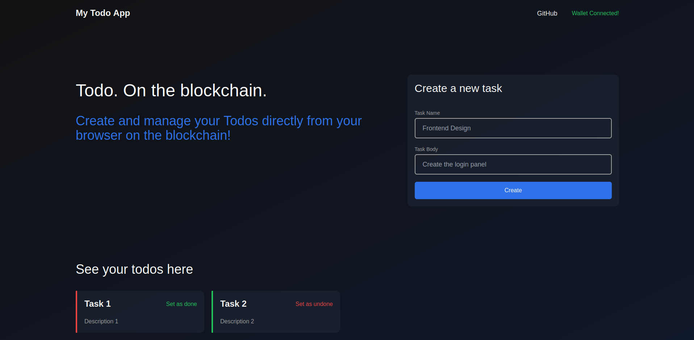

# Todo App - On the Blockchain

This application demonstrates the very basic working of an application on the blockchain using a todo list.

## Tech Stack
- ReactJS
- Solidity
- Truffle
- Ganache
- Ethereum
- Metamask
- Ethers
- TailwindCSS

## How to run
- Set up Ganache GUI/CLI, Metamask, Truffle, NodeJS, NPM
- Start Ganache on `http://localhost:8545`
- Clone the repository
- Navigate into the `todo-app-client` folder
- Run `npm install`
- Navigate into the `todo-app-contracts` folder
- Run `truffle compile && truffle deploy`
- Copy the contract address from the terminal and paste it in `todo-app-client/src/constants/index.ts` in the `contractAddress` object.
- Copy the contract build from `todo-app-smart-contract/build/contracts/Todo.json` and paste it in `todo-app-client/src/util/` folder.
- Run `npm run dev`
- Open `http://localhost:3000` in your browser.